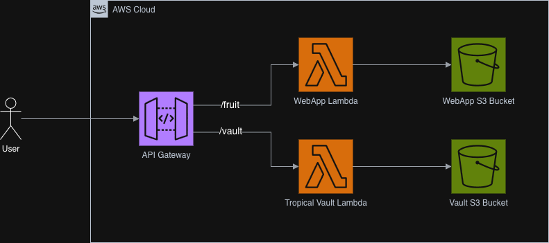

### **AWS IaC & Security Workshop Guide**

Welcome! In this workshop, you will use professional tools to deploy a serverless web application to AWS and then act as a security auditor to find and exploit a critical vulnerability.

**Objectives:**

- Get temporary, secure AWS credentials from an API.
- Use GitHub Actions and Terraform to deploy your own personal infrastructure.
- Use the AWS CLI to manage S3 resources.
- Use Prowler to perform a security audit.
- Discover and exploit a common web application vulnerability.

**Requirements:**

- Github account: If you dont have one you can create one for free 
- Laptop with : Mac Terminal, Linux, Windows with WSL

---

## Part 0: Environment Setup

Before you begin, you must set up your local machine with the necessary tools. \
Can be skipped if already done.

<details>
    <summary><strong>Show me how to setup my Environment</strong></summary>

### Step 1: Get a Terminal

You will run all commands in a terminal.

* **On macOS:** You are all set. Open the **Terminal** app.
* **On Linux:** You are all set. Open your standard terminal.
* **On Windows:** You must install **Windows Subsystem for Linux (WSL)**.
1. Open **PowerShell** as an **Administrator**.
2. Run the following command to install WSL and a default Ubuntu Linux distribution:
   
     ```
     wsl --install
     ```
     
3. Restart your computer when prompted.
4. After restarting, open **Ubuntu** from your Start Menu. **You must run all subsequent commands inside this Ubuntu (WSL) terminal.**

### Step 2: Install Git

* **On macOS:**
1. First, install the Homebrew package manager (if you don't have it):

     ```bash
     /bin/bash -c "$(curl -fsSL [https://raw.githubusercontent.com/Homebrew/install/HEAD/install.sh](https://raw.githubusercontent.com/Homebrew/install/HEAD/install.sh))"
     ```
     
2. Now, install `git`:
   
     ```bash
     brew install git
     ```
   
* **On Linux / WSL (Ubuntu):**

   ```bash
   sudo apt update
   sudo apt install git -y
   ```

### Step 3: Install the AWS CLI (v2)

* **On macOS:**
1. Download the official `.pkg` installer:

   ```bash
   curl https://awscli.amazonaws.com/AWSCLIV2.pkg -o "AWSCLIV2.pkg"
   ```
   
2. Run the installer:
   
   ```bash
   sudo installer -pkg AWSCLIV2.pkg -target /
   ```
   
* **On Linux / WSL (Ubuntu):**
1. Download the installer:
   
   ```bash
      curl "https://awscli.amazonaws.com/awscli-exe-linux-x86_64.zip" -o "awscliv2.zip"
   ```
   
2. Unzip the installer:
   
   ```bash
   sudo apt install unzip -y
   unzip awscliv2.zip
   ```

3. Run the installer:
   
   ```bash
   sudo ./aws/install
   ```

4. Verify the installation:

   ```bash
   aws --version
   ```

### Step 4: Install Python & Pip (for Prowler)

* **On macOS:**
1. Install Python 3 and Pip using Homebrew:
   
   ```bash
   brew install python3
   ```

* **On Linux / WSL (Ubuntu):**
1. Install the necessary Python packages:
   
   ```bash
   sudo apt update
   sudo apt install python3-full python3-pip python3-venv
   ```

</details>

---

## **Part 1: Setup & Deployment**

### **Step 1: Get Your AWS Credentials**

Your instructor has provided you with a unique "fruit" name , a password and API url.

1. Open your terminal

- On Windows: open WSL (Ubuntu) or any Linux shell
- On macOS/Linux: open Terminal

2. Run the `curl` command below, replacing `<your-password>`, `<instructor-api-url>`, and `<Fruit>` with the ones you were given.

```bash
curl -u "student:<your-password>" https://<instructor-api-url>/<Fruit>
```

Example:

```bash
curl -u "student:P@ssw0rd!" https://api.example.edu/Banana
```

3. The command will return a JSON object. **Keep this terminal window open** or copy the `AccessKeyId`, `SecretAccessKey`, and `SessionToken` values. You will need them in a moment.


### **Step 2: Fork and Clone the Project**

1. Go to the  https://github.com/Spike-Digital-Reply-DE/TUM-Deadalus-Cloud-Security  repository on GitHub (Personal) and click the **Fork** button to create your own copy.
2. On your fork's GitHub page, click the green `< > Code` button and copy the HTTPS URL.
3. In your terminal, clone your fork:

```bash
git clone https://github.com/<your-username>/TUM-Deadalus-Cloud-Security.git
```

4. Authenticate yourself with your GitHub credentials inside your terminal
    a. Here you have to use your PAT not your password
    b. If you don't have a PAT, create one on your GH Settings -> Developer settings -> PATs -> Tokens (classic) -> Generate new token (classic)
5. Navigate into the project directory 

```bash
cd TUM-Deadalus-Cloud-Security
```

### **Step 3: Configure Your Secrets**

You need to provide your credentials to your repository's CI/CD pipeline.

1. **Set Secrets in GitHub:** In your forked repository on GitHub, go to **Settings > Secrets and variables > Actions**. Create the following three **Repository** secrets:
    - `AWS_ACCESS_KEY_ID`: Paste the `AccessKeyId` you received in Step 1.
    - `AWS_SECRET_ACCESS_KEY`: Paste also the `SecretAccessKey` you received.
    - `AWS_SESSION_TOKEN`: Paste also the `SessionToken` you received.
    - **Attention:** Paste only the key without quotation marks inside the secrets variables.

### **Step 4: Deploy Your Application**

1. Go to the **Actions** tab of your forked repository.
2. In the left sidebar, click on the **"Deploy Terraform to AWS"** workflow.
3. Click the **"Run workflow"** button
4. Wait for the pipeline to complete successfully. When it's finished, click on the completed run, go to the `Terraform Apply` step, and find the `api_endpoint` URL in the output. **Copy this URL.**

**Step 5: Test Your Application**

1. Call the API URL with your bucket, that you both got from your workflow outputs, and also with your token, that you generated.

Replace the placeholders with your values.
* `<your_api_endpoint>`: The URL you just copied.
* `<your-bucket-name>`: The name of the bucket you created in your `s3.tf` file (e.g., `webapp-bucket-guava`).

```bash
curl "https://<your_api_endpoint>/dev/fruit?bucket=<your-bucket-name>&file=fruitsalad.png" > fruitsalad.png
```

2. After running the command you should have a `fruitsalad.png` file in your directory.
3. To view the image:
    * **On Linus / WSL:** Run `explorer.exe .` to open the folder in Windows Explorer.
    * **On macOS:** Run `open fruitsalad.png`.

---

## Part 2: Practice Infrastructure as Code

Now that your base infrastructure is running, your task is to expand it using Terraform code. You will add a second image to the repository and deploy it automatically.

1.  **Add a New Image:**
    * Find any small image file (e.g., a logo or an icon) on your computer.
    * Save it into the `image/` folder of your cloned repository.

2.  **Update Terraform Code:**
    * Open the `s3.tf` file in your code editor.
    * Add a new `aws_s3_object` resource block to upload this new file.

3.  **Deploy Changes:**
    * Commit and push your changes to GitHub to trigger the deployment.

    ```bash
    git add .
    git commit -m "Add second image via Terraform"
    git push
    ```
    * Watch the **Actions** tab in GitHub. The workflow should run automatically (or trigger it manually if needed) and apply the changes.

4.  **Verify the New Image:**
    * Once the deployment succeeds, try to retrieve this new image using your API, adjusting the command you executed before.
    * If successful, you have deployed content using Infrastructure as Code!

---

## **Part 3: The Security Lab**

### **Step 1: Configure aws credentials**

1. **Configure your CLI:** In your terminal, run the following three commands, pasting in the AWS credentials from Step 1.

```bash
export AWS_ACCESS_KEY_ID=<PASTE_YOUR_ACCESS_KEY_ID>
export AWS_SECRET_ACCESS_KEY=<PASTE_YOUR_SECRET_ACCESS_KEY>
export AWS_SESSION_TOKEN=<PASTE_YOUR_SESSION_TOKEN>
```

### **Step 2: The Security Audit (Discovery)**

Now you will act as a security auditor to find misconfigurations.

1. **Install Prowler:** We will use a Python virtual environment to keep our system clean.

```bash
python3 -m venv prowler-env
prowler-env/bin/activate
pip install prowler
```

2. **Run Prowler:** Run the scan. This can take 5-15 minutes.

```bash
prowler aws
```

3. **Analyze the Report:** Prowler will create an HTML report in the `output` directory. Open it and filter for S3 findings. Tip: Look for resources that could potentially contain sensitive data.

### **Step 3: Investigate and Exploit**

1. **Find the Target File:** Use the AWS CLI to see what's inside the vulnerable resource you found.

```bash
aws <resource_type> ls <vulnerable_resource>/
```

2.   You will receive the name of a file as output.
3. **The Vulnerability:** Your application code (`lambda/index.py`) has a security misconfiguration.
4. **Exploitation and Exfiltration**: Find and exploit the vulnerability to exfiltrate the file containing sensitive data.
5. **View the Secret:** Once you have the file on your machine, have a look inside and show us. Congratulations, you have completed the hack!

---

## Part 4: Bonus Hack



### Attack Scenario

There is now a 2nd Lambda, called `tropical vault` which is exposed via the `/vault` endpoint in your API Gateway.

A user is supposed to view beatiful tropical pictures that are stored in the `/public` directory of an S3 Bucket \
e.g. by calling `curl "https://<your_api_endpoint>/dev/vault&file=tropical`

Unfortunately, the developer of this application was lazy and used the same bucket to also store sensitive data in it. There is a file in the S3 Bucket at `/critical/financials.png` which is not supposed to be read by a user.

Take a moment to analyze the source code in `lambda/tropical_vault.py`.

**Your Goal:** You are in the role of an application user. Trick the application into retrieving the sensitive data for you.

<details>
    <summary><strong>Give me a hint.</strong></summary>

Path traversal

<details>
    <summary><strong>Another Hint.</strong></summary>
      
Maybe we can try to trick the code by using a different representation of characters (encoding)

<details>
    <summary><strong>I need yet another one.</strong></summary>

Ensure that you only use characters that pass the regex check in the code.
What about the "." dot character? Can we also encode it?

<details>
    <summary><strong>Please help meeeee!</strong></summary>

It seems the application is smart enough to figure out our simple encoding!
We need more POWER! <sub><sup>(maybe twice as much?)</sup></sub>
  
<details>
    <summary><strong>Give me the solution!</strong></summary>

Can it withstand a doubly-encoded string? muahaha!!!!

The payload to reach `../critical/financials` is:
```
`file=%252E%252E%252Fcritical%252Ffinancials`
```

</details>

</details>

</details>

</details>

</details>

### Fix

How can we fix this exploit the cloud-native way? 

<details>
    <summary><strong>Give me a hint.</strong></summary>

Least Privilege Principle!

<details>
    <summary><strong>Another Hint.</strong></summary>
      
Is there a policy that allows access to the bucket?

<details>
    <summary><strong>I need yet another one.</strong></summary>

Can we make the resource "aws_s3_bucket_policy.tropical_vault_bucket_policy" more restrictive?

<details>
    <summary><strong>Please help meeeee!</strong></summary>

An asterisk "*" on root level in a policy is never a good sign!
  
<details>
    <summary><strong>Give me the solution!</strong></summary>

Update the bucket policy to only allow the lambda access to the /public path.

```
resource "aws_s3_bucket_policy" "tropical_vault_bucket_policy" {
  bucket = aws_s3_bucket.tropical_vault_bucket.id
  policy = jsonencode({
    Version = "2012-10-17",
    Statement = [{
      Sid       = "AllowLambdaReadAccess",
      Effect    = "Allow",
      Principal = {
        AWS = data.aws_iam_role.web_lambda_exec_role.arn
      },
      Action    = "s3:GetObject",
      Resource  = "${aws_s3_bucket.tropical_vault_bucket.arn}/public/*"
    }]
  })
}
```

Now, your application code can be as vulnerable as ever, but the blast radius of the exploit is minimal.

</details>

</details>

</details>

</details>

</details>

---

## **Part 5: Cleanup**

To avoid any unnecessary costs, you must delete all the resources you created.

1. Go to the **Actions** tab of your forked repository.
2. In the left sidebar, click on the **"Terraform Destroy"** workflow.
3. Click the **"Run workflow"** button.
